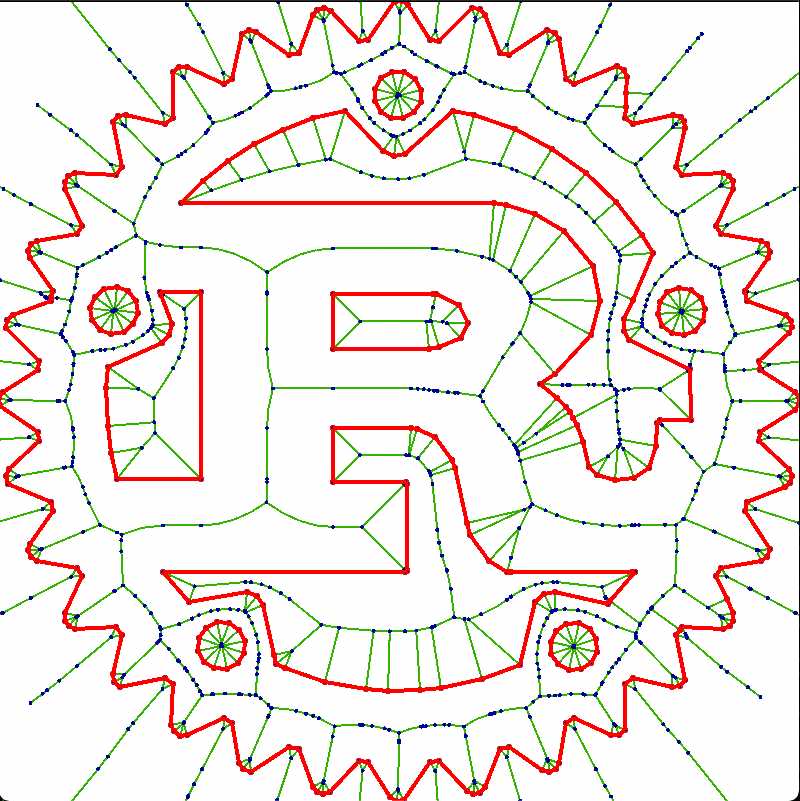

# boostvoronoi.rs
Boost 1.75.0 polygon::voronoi ported to 100% rust.
This implementaton of Forune's algorithm works on line segments as well as points, making it useful for finding centerlines or whatnot.



Quick example:
```fish
set -x LIBRARY_PATH /opt/local/lib/ #or wherever you store your SDL
cargo run --example piston_gui
```

API example:
```rust
type I1 = i32; // this is the integer input type
type F1 = f64; // this is the float output type (circle event coordinates)
type I2 = i64; // All integer calculations are made in this type (or num::BigInt when needed)
type F2 = f64; // All float calculations are made in this type
// it is ok to set I1=I2=i64 and F1=F2=f64

// points should be unique
let p = vec![Coordinate{x:9, y:10}];
// lines should never intersect with other lines, identical end or start points is ok.
let s = vec![Line::new(Coordinate{x:10, y:11}, Coordinate{x:12, y:13})];
let mut vb = VoronoiBuilder::<I1, F1, I2, F2>::new();
  
// you will have to keep track of the input geometry. it will be referenced as 
// input geometry index in the output. 
vb.with_vertices(p.iter()).expect("test");
vb.with_segments(s.iter()).expect("test");

// this will generate a the list of cells, edges and circle events (aka vertices)
vb.construct().expect("test")

```
Edges may become curves when line segments are used as input, see the example code for discretization and interpolation. 

## Todo
- [ ] Evaluate the generic API. Is <I1, F1, I2, F2> really needed?
- [ ] Maybe replace the builtin ulp implementation
- [ ] Maybe replace num::BigInt with something stack friendly
- [ ] Add many more test cases for voronoi_robust_ftp.rs, specially for ulp
- [ ] Remove use of vec_map::VecMap, probably only needed for circle events
- [ ] Benchmark and optimize

#

All credit goes to the original authors (Andrii Sydorchuk), except the porting mistakes. They are all mine.

